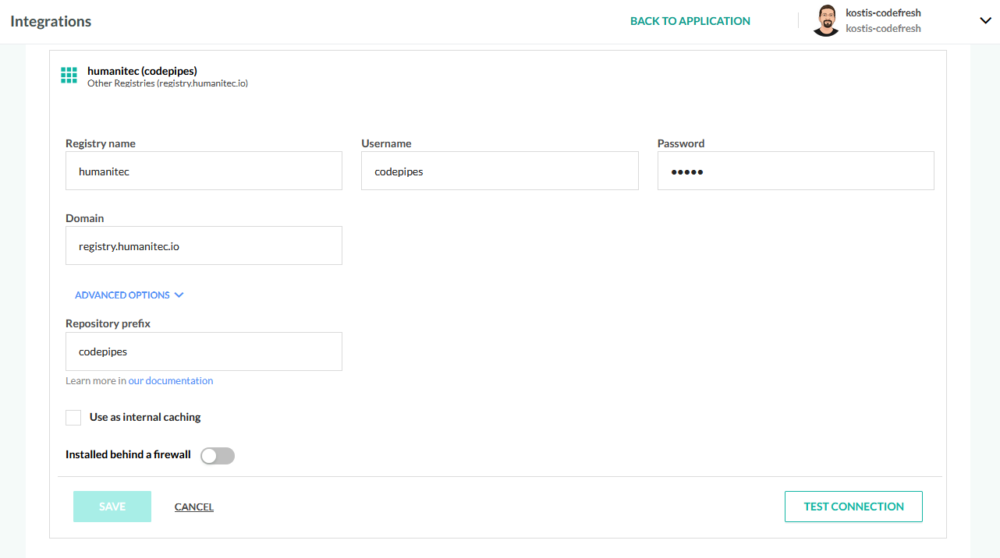
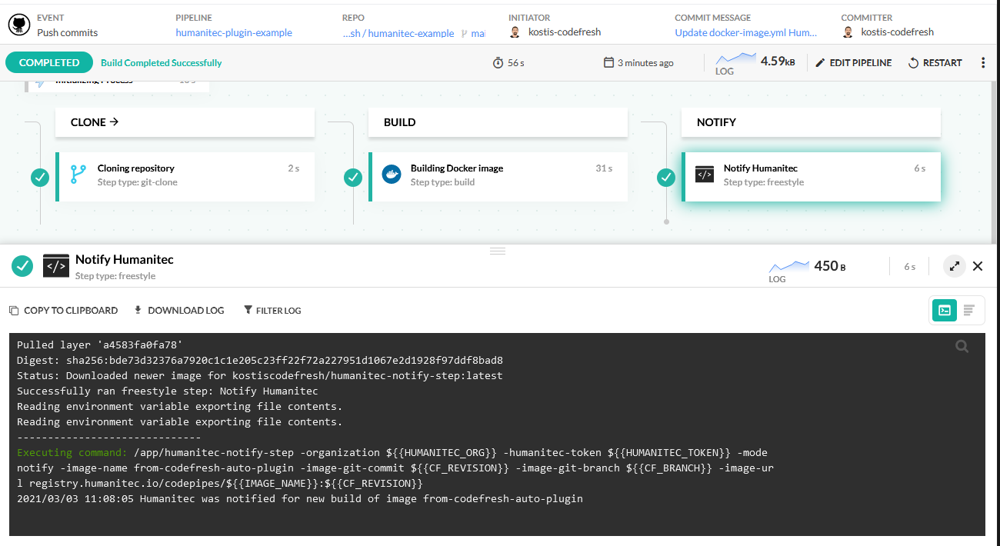

# Codefresh - Humanitec integration

This is an example for pushing a container image from Codefresh to Humanitec anda notifying Humanitec for the new build

## Step 1 - Connect the Humanitec Registry to Codefresh

Follow the instructions for [getting the registry credentials](https://github.com/kostis-codefresh/humanitec-notify-step) and connect the Humanitec Registry as [an external 
Registry in Codefresh](https://codefresh.io/docs/docs/integrations/docker-registries/other-registries/)

You can optionally fill in the *Repository prefix* field with your Humanitec Organization so that you don't have
to remember to include it in your push steps

## Step 2 - Create a Codefresh pipeline that builds/pushes an image

See file [codefresh.yml](codefresh.yml) for the full pipeline.

It does the following.

1. Clones the source code of your app
1. Builds a container image and pushes it to the Humanitec registry
1. Notifies Humanitec for the new build

The notification source code is at [https://github.com/kostis-codefresh/humanitec-notify-step](https://github.com/kostis-codefresh/humanitec-notify-step)

